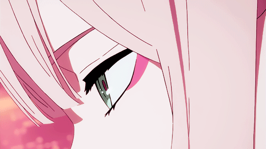
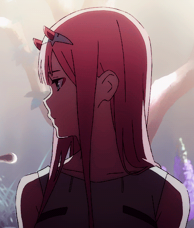

  
  

---

### Yo, I'm Hall 👋

- 🖤 Beginner dev  
- 🧠 Currently learning: Git, GitHub, HTML, CSS and JavaScript  
- 🛠️ Building cool projects  
- 💬 Always up for a chat and a good laugh 😁  

  

---

### 🧠 My Skills

  
  
  
  
  

  

---

### 📡 Find me

  
  
  
  
  

---

  

